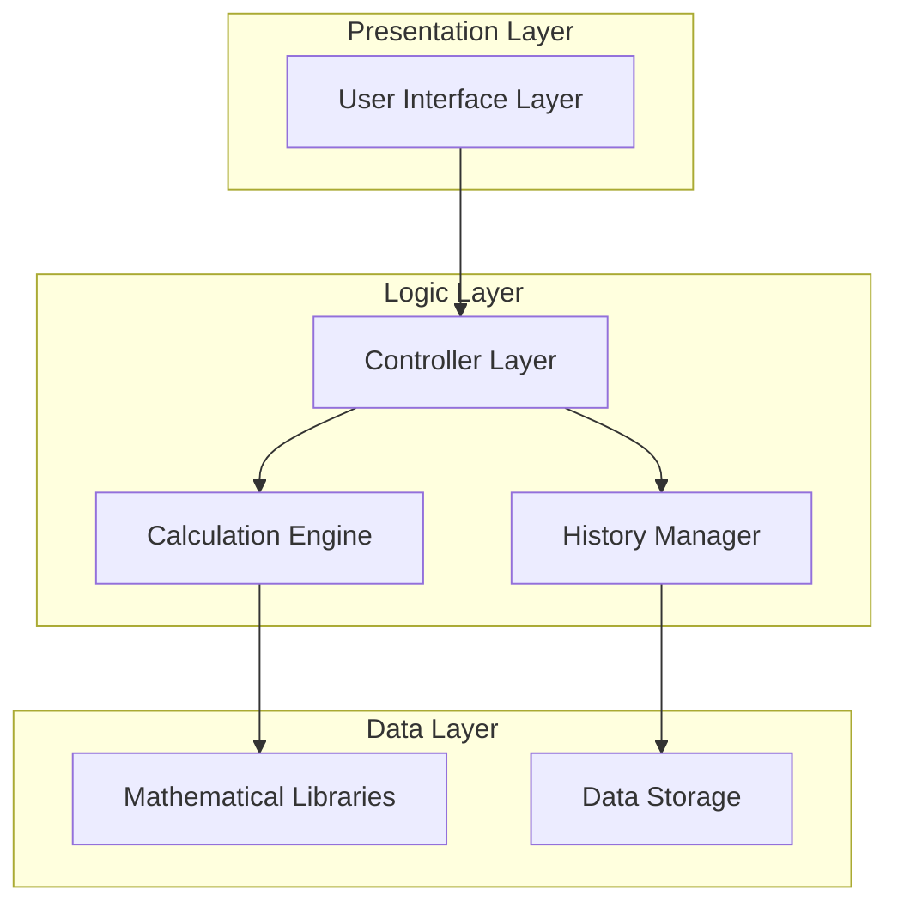

# Scientific Calculator Application - Architecture Plan

## 1. Overview

This document outlines the architectural plan for a scientific calculator application with a GUI interface, capable of performing advanced mathematical operations and compiling to a Windows executable. The application will utilize a virtual environment for dependency management.

## 2. Technology Stack

### Programming Language
**Python** - Selected for the following reasons:
- Extensive mathematical libraries (math, numpy, scipy)
- Cross-platform compatibility
- Rich ecosystem for GUI development
- Easy to create virtual environments
- Simple packaging and distribution

### GUI Framework
**Tkinter** - Chosen because:
- Built-in with Python, no additional dependencies
- Lightweight and suitable for calculator UI
- Cross-platform compatibility
- Well-documented and mature

### Build Tools
**PyInstaller** - Selected for:
- Ability to compile Python applications to Windows executables
- Cross-platform support
- Simple configuration
- Good documentation and community support

### Virtual Environment
**venv** - Python's built-in virtual environment tool:
- No additional dependencies required
- Standard tool in Python ecosystem
- Easy to set up and manage

## 3. System Architecture



### Architecture Description
The application follows a three-layer architecture:
1. **Presentation Layer**: Handles all UI interactions and display
2. **Logic Layer**: Contains business logic, calculations, and history management
3. **Data Layer**: Provides mathematical functions and data persistence

## 4. Component Breakdown

### 4.1 User Interface Layer
- **CalculatorDisplay**: Shows input, output, and history
- **ButtonPanel**: Contains all calculator buttons organized by function groups
- **MenuBar**: Provides access to settings and help

### 4.2 Controller Layer
- **InputHandler**: Processes button clicks and keyboard input
- **ExpressionEvaluator**: Converts input into mathematical expressions
- **OutputFormatter**: Formats results for display

### 4.3 Calculation Engine
- **TrigonometryModule**: sin, cos, tan, and their inverses (using degrees by default)
- **LogarithmModule**: log, ln, and other logarithmic functions
- **PowerModule**: Exponents, roots, and related operations
- **FactorialModule**: Factorial calculations
- **FractionModule**: Fraction handling and operations

### 4.4 History Manager
- **HistoryStorage**: Saves and retrieves calculation history
- **HistoryPresenter**: Formats history for display

### 4.5 Mathematical Libraries
- **Standard Library**: Python's built-in math functions
- **Extended Library**: Additional functions from numpy/scipy if needed

## 5. File Organization

```
scientific_calculator/
│
├── venv/                    # Virtual environment (not committed)
├── src/                     # Source code
│   ├── __init__.py
│   ├── main.py             # Application entry point
│   ├── gui/                # GUI components
│   │   ├── __init__.py
│   │   ├── calculator_gui.py
│   │   ├── display.py
│   │   └── buttons.py
│   ├── core/               # Core logic
│   │   ├── __init__.py
│   │   ├── calculator.py
│   │   ├── expression_parser.py
│   │   └── history_manager.py
│   ├── math/               # Mathematical operations
│   │   ├── __init__.py
│   │   ├── trigonometry.py
│   │   ├── logarithms.py
│   │   ├── powers.py
│   │   ├── factorials.py
│   │   └── fractions.py
│   └── utils/              # Utility functions
│       ├── __init__.py
│       └── helpers.py
│
├── tests/                  # Unit tests
│   ├── __init__.py
│   ├── test_calculator.py
│   ├── test_math_modules.py
│   └── test_gui.py
│
├── docs/                   # Documentation
│   └── user_manual.md
│
├── resources/              # UI resources
│   ├── icons/
│   └── themes/
│
├── requirements.txt        # Python dependencies
├── setup.py               # Installation script
├── pyinstaller.spec       # PyInstaller configuration
├── README.md
└── LICENSE
```

## 6. Dependency Management

### Virtual Environment Setup
```bash
python -m venv venv
source venv/bin/activate  # On Windows: venv\Scripts\activate
pip install -r requirements.txt
```

### Dependencies
The `requirements.txt` file will include:
- Standard Python libraries (no additional dependencies needed for basic Tkinter)
- Testing framework (pytest)
- Packaging tools (pyinstaller)

### Dependency Isolation
- All dependencies will be contained within the virtual environment
- No system-wide installations required
- Easy to reproduce the development environment

## 7. Build and Deployment

### Development Workflow
1. Set up virtual environment
2. Install dependencies
3. Run application in development mode
4. Execute tests

### Building Windows Executable
```bash
pyinstaller --onefile --windowed src/main.py
```

### Distribution
- Single executable file for Windows
- No additional installation required
- Self-contained with all dependencies

## 8. Key Design Decisions

1. **Python + Tkinter**: Chosen for simplicity, built-in GUI support, and mathematical capabilities
2. **Three-layer architecture**: Ensures separation of concerns and maintainability
3. **Modular math components**: Each mathematical function group in separate modules for easy maintenance
4. **Virtual environment**: Ensures dependency isolation and easy setup
5. **PyInstaller for packaging**: Well-established tool for creating executables from Python applications
6. **File organization**: Clear separation of concerns with intuitive directory structure

## 9. Future Extensibility

The modular architecture allows for easy addition of:
- New mathematical functions
- Different UI themes
- Additional output formats
- Advanced features like graphing capabilities
- Support for other operating systems