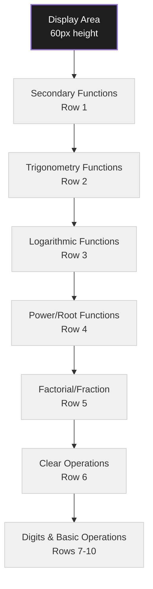

# Scientific Calculator GUI Design

## 1. Overview

This document outlines the GUI design for the scientific calculator application based on the architecture plan. The design focuses on usability, functionality, and a clean visual aesthetic using Tkinter as the GUI framework.

## 2. Layout Structure

The calculator follows a grid-based layout with the following main areas:

### 2.1 Display Area
- **Main Display**: Shows current input and calculation results
- **History Display**: Shows previous calculations (optional secondary display)

### 2.2 Button Panel Organization
The buttons are organized into functional groups for intuitive access:

```
[Display Area - 60px height]
--------------------------------------------------
[Secondary Functions] [Trigonometry] [Logarithms]
[Power/Root] [Factorial/Fraction] [Clear Operations]
--------------------------------------------------
[7] [8] [9] [/] [sin] [cos] [tan]
[4] [5] [6] [*] [log] [ln] [e^x]
[1] [2] [3] [-] [x²] [√x] [x!]
[0] [.] [=] [+] [1/x] [±] [%] [C] [AC] [DEL]
--------------------------------------------------
```

### 2.3 Detailed Layout Structure

#### Row 1: Display
- Single-line display showing input and results
- Left-aligned text for numbers and error messages
- Approximately 40 characters wide

#### Rows 2-3: Scientific Function Groups
- Row 2: Secondary functions (π, e, etc.), trigonometric functions (sin, cos, tan), and their inverses
- Row 3: Logarithmic functions, power/root functions, factorial and fraction operations

#### Rows 4-7: Primary Functions
- Row 4: Clear operations (C, AC)
- Rows 5-8: Standard calculator layout with digits, basic operations, and additional scientific functions

## 3. Component Specifications

### 3.1 Display Area
- **Height**: 60px
- **Font**: "Courier" or "Consolas", 18pt, bold
- **Background**: #1e1e1e (dark gray)
- **Text Color**: #ffffff (white)
- **Border**: 2px solid #333333
- **Padding**: 10px

### 3.2 Buttons
All buttons follow consistent styling for usability:

#### Standard Buttons
- **Size**: 60px x 60px
- **Font**: "Arial", 12pt, bold
- **Background**: #f0f0f0 (light gray)
- **Text Color**: #000000 (black)
- **Border**: 1px solid #cccccc
- **Hover Effect**: Background changes to #e0e0e0
- **Active Effect**: Background changes to #d0d0d0

#### Operation Buttons (+, -, *, /)
- **Size**: 60px x 60px
- **Font**: "Arial", 12pt, bold
- **Background**: #ff9500 (orange)
- **Text Color**: #ffffff (white)
- **Border**: 1px solid #cc7700
- **Hover Effect**: Background changes to #ffad33
- **Active Effect**: Background changes to #e68500

#### Function Buttons (sin, cos, etc.)
- **Size**: 60px x 60px
- **Font**: "Arial", 12pt, bold
- **Background**: #4a4a4a (dark gray)
- **Text Color**: #ffffff (white)
- **Border**: 1px solid #333333
- **Hover Effect**: Background changes to #5a5a5a
- **Active Effect**: Background changes to #3a3a3a

#### Special Buttons (=, AC)
- **Size**: 60px x 60px
- **Font**: "Arial", 12pt, bold
- **Background**: #ff2d5 (red for AC), #34c759 (green for =)
- **Text Color**: #ffffff (white)
- **Border**: 1px solid #cc2445 (for AC), #2a9c48 (for =)
- **Hover Effect**: Background changes to #ff4d6d (for AC), #4cd975 (for =)
- **Active Effect**: Background changes to #e6294d (for AC), #30b354 (for =)

### 3.3 Window Specifications
- **Minimum Size**: 400px x 500px
- **Resizable**: Yes, with constraints
- **Title**: "Scientific Calculator"
- **Icon**: Calculator icon (to be designed)
- **Background**: #f5f5f5 (light gray)

## 4. User Interaction Flow

### 4.1 Basic Operations
1. User clicks digit buttons (0-9) to input numbers
2. User selects operation (+, -, *, /)
3. User inputs second number
4. User presses equals (=) to calculate result
5. Result is displayed in the main display area

### 4.2 Scientific Functions
1. User inputs number or expression
2. User clicks scientific function button (sin, cos, log, etc.)
3. Function is applied to the current value or expression
4. Result is displayed immediately

### 4.3 Clear Operations
- **C (Clear)**: Clears the current input but retains calculation history
- **AC (All Clear)**: Resets the calculator to initial state

### 4.4 Keyboard Support
- Digits 0-9: Direct input
- +, -, *, /: Operation keys
- Enter/= : Equals
- Escape: All Clear
- Backspace: Clear/Backspace
- Period (.): Decimal point

### 4.5 Error Handling
- Division by zero: Display "Error"
- Invalid operations: Display "Error"
- Overflow: Display "Error" or scientific notation
- Error state cleared by pressing C or AC

### 4.6 Feedback Mechanisms
- Button press visual feedback (color change)
- Audible feedback (optional setting)
- Display updates immediately after each operation

## 5. Visual Design Mockups

### 5.1 Main Calculator Layout



### 5.2 Button Layout Detail

```mermaid
graph LR
    A[7<br/>60x60] --> B[8<br/>60x60]
    B --> C[9<br/>60x60]
    C --> D[/<br/>60x60<br/>Orange]
    D --> E[sin<br/>60x60<br/>Dark Gray]
    E --> F[cos<br/>60x60<br/>Dark Gray]
    F --> G[tan<br/>60x60<br/>Dark Gray]
    
    style A fill:#f0f0f0,stroke:#ccc,stroke-width:1px
    style B fill:#f0f0f0,stroke:#ccc,stroke-width:1px
    style C fill:#f0f0f0,stroke:#ccc,stroke-width:1px
    style D fill:#ff9500,stroke:#cc7700,stroke-width:1px,color:#fff
    style E fill:#4a4a4a,stroke:#333,stroke-width:1px,color:#fff
    style F fill:#4a4a4a,stroke:#333,stroke-width:1px,color:#fff
    style G fill:#4a4a4a,stroke:#333,stroke-width:1px,color:#fff
```

## 6. Key Design Decisions

### 6.1 Layout Organization
- **Grid-based design**: Provides consistency and predictability
- **Functional grouping**: Related functions are grouped together for easier access
- **Standard calculator layout**: Familiar arrangement for basic operations
- **Extended scientific functions**: Additional rows for advanced operations

### 6.2 Visual Design
- **High contrast display**: Dark background with light text for better readability
- **Color-coded buttons**: Different colors for different button types to aid recognition
- **Consistent sizing**: All buttons are the same size for uniform appearance
- **Responsive feedback**: Visual feedback for button presses

### 6.3 Usability Features
- **Keyboard support**: Allows both mouse and keyboard input
- **Error handling**: Clear error messages and recovery options
- **Visual feedback**: Immediate response to user actions
- **Scalable design**: Responsive layout that works on different screen sizes

### 6.4 Technical Considerations
- **Tkinter compatibility**: Design works within Tkinter's capabilities
- **Cross-platform appearance**: Will look consistent on Windows, macOS, and Linux
- **Performance**: Simple design that won't impact calculation performance
- **Extensibility**: Modular design allows for future feature additions

## 7. Future Considerations

### 7.1 Potential Enhancements
- Theme support (light/dark mode)
- Customizable button layouts
- History panel with scrollable previous calculations
- Memory functions (M+, M-, MR, MC)
- Parentheses for complex expressions
- Degree/Radian mode toggle

### 7.2 Accessibility
- High contrast mode
- Larger font options
- Keyboard navigation
- Screen reader compatibility

This GUI design provides a solid foundation for the scientific calculator application that balances functionality with usability, following the architecture plan's requirements while ensuring an intuitive user experience.